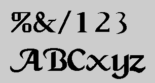

# Caligula

The following text is the original README.TXT file from the 1994 vintage collection that the font appeared in.  I've only included the TrueType version at this time because the standards that have been ratified make the other formats generally unnecessary.  Although it is required to distribute the document with the font, most of the information is purely historical.  For example, CompuServe went offline years ago.

---

Accompanying this README.TXT file is the Caligula font. Caligula is a crude
representation of what was originally a calligraphic bitmap font autotraced by
Fontographer 3.2. There are no kerning pairs in this font and it should
probably be use only in sizes 24pt or larger. It is fully compatible with ATM
for Windows, allowing it to be seen on screen at any size, and print to any
printer that has a Windows driver.

Font Formats:
- Adobe (Type 1 [pfa & pfb], Type 3, Bitmap)
- DMF (+ bitmap)
- Bitmap (Black&White)
- IntelliFont
- Truetype

Font ID:      48144

Directory:    Script/Caligula

For further information about Fontographer 3.2, call or write:

Altsys Corporation
269 W. Renner Rd.
Richardson, TX 75080
Phone: (214) 680-2060

CompuServe: 76004,2071
FAX: (214) 680-0537
MCI Mail: ALTSYS
AppleLink: D0590
America Online: Altsys

This font is Public Domain. You can copy this font with the readme files only!
